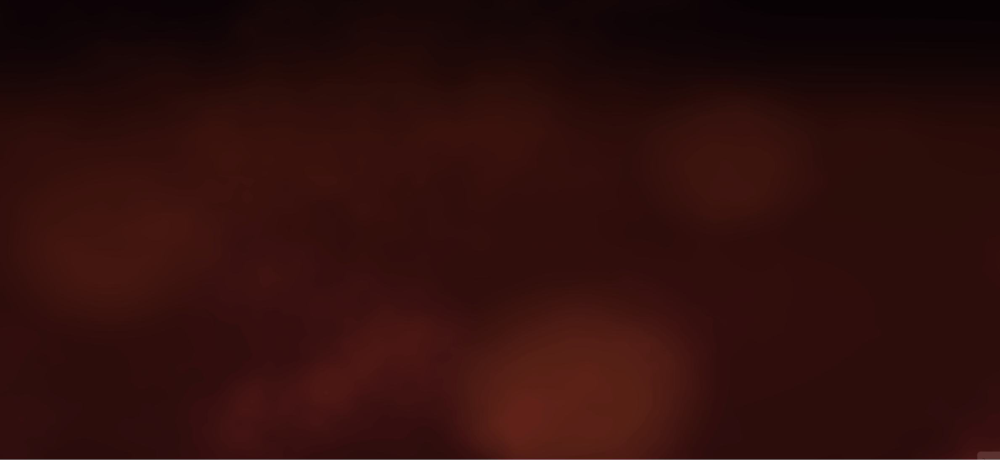
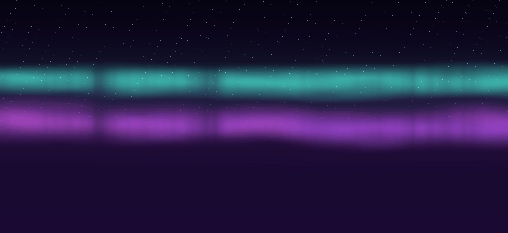
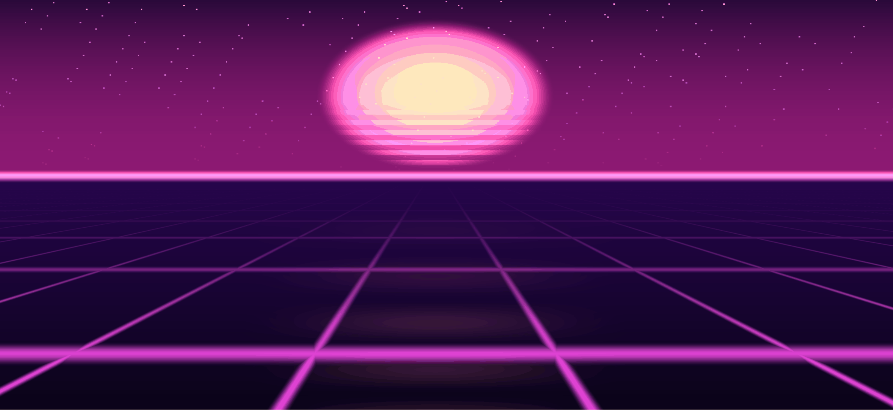
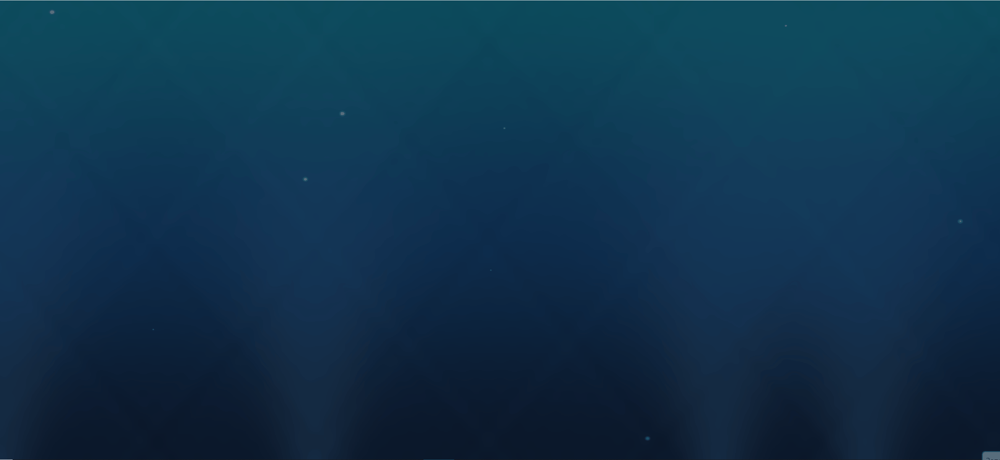
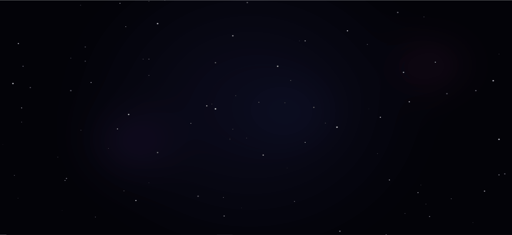
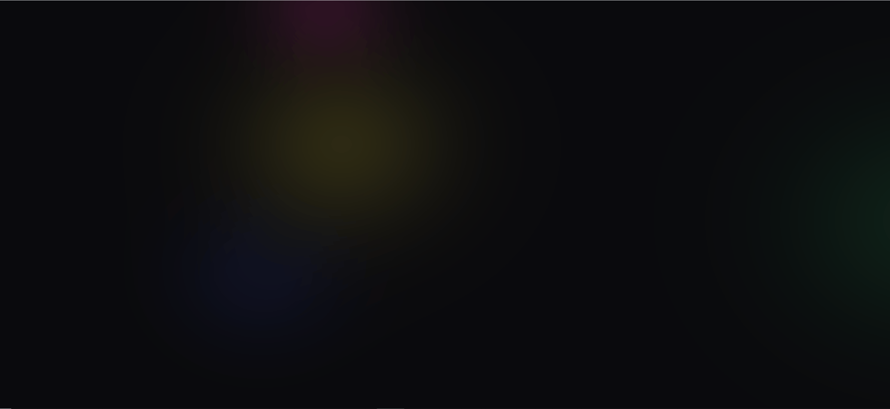

# Lava Backgrounds — drop-in WebGL2 библиотека фонов

Семь полноэкранных фоновых шейдеров. Рассчитаны на повторное использование в играх, опроснике, демках, любых HTML-страницах.

## Файлы

| Файл | Что |
|---|---|
| [backgrounds.js](backgrounds.js) | Движок + шейдеры + публичный API |
| [backgrounds.html](backgrounds.html) | Demo-страница с переключателем |

## Шейдеры

### Embers — лавово-ламповая эстетика


Тёплое течение FBM-noise + 3 медленных крупных blobs + нижний горячий ореол. Подходит для огненной тематики.

### Aurora — полярное сияние


Две волнистые полосы (зелёно-бирюзовая + фиолетово-розовая) с вертикальными стриатами, звёзды наверху. Подходит для холодной/технологичной тематики.

### Synthwave (`grid`) — ретро-сетка + солнце


Перспективная неоновая сетка убегающая к горизонту + диск солнца со стрипами + розовый ореол на горизонте + отражение. Подходит для игр, лендингов.

### Rain — дождь


Три слоя диагональных струй с parallax (ближние быстрее и ярче) + брызги внизу с расширяющимися кольцами + туман/vignette. Fog-blue палитра. Подходит для нейтрально-прохладной атмосферы, val=3-4 орба, moody-страниц.

### Ocean — глубокое море


Сине-бирюзовый градиент + каустические узоры (6 sin-слоёв в pixel-space), 4 световых луча сверху, 25 пузырьков с procedural-анимацией. Aspect-corrected. Подходит для холодных страниц, val=1-3 орба, подводной темы.

### Space — звёзды и туманности


150 звёзд с мерцанием (детерминированные координаты через hash, никаких CPU-аргументов), 3 плавающие туманности трёх разных цветов (пурпур, индиго, розовый), радиальный dark vignette. Aspect-corrected. Подходит для sci-fi, игр, cover-страниц.

### Abstract — гипнотические blobs


4 анимированные размытые blobs с вращающимся hue (0°/90°/180°/270°), каждый плавает со своей скоростью. Светлая и тёмная тема автоматически. Подходит для модных лендингов, нейтральной атмосферы без жанровой привязки.

## Подключение

```html
<canvas id="bg-canvas" style="position:fixed;top:0;left:0;width:100%;height:100%;z-index:-1;pointer-events:none;"></canvas>
<script src="backgrounds.js"></script>
<script>
  LavaBackgrounds.init(document.getElementById('bg-canvas'), { mode: 'aurora', dark: true });
</script>
```

## API

```js
LavaBackgrounds.init(canvas, { mode, dark });  // mode: 'none'|'embers'|'aurora'|'grid'|'rain'|'ocean'|'space'|'abstract'
LavaBackgrounds.setMode(mode);                 // Переключить фон на лету
LavaBackgrounds.setTheme('dark' | 'light');    // Тема — где шейдер поддерживает (embers/rain/ocean/space/abstract)
LavaBackgrounds.destroy();                     // Полная очистка — остановить rAF, удалить listeners
LavaBackgrounds.listModes();                   // ['none','embers','aurora','grid','rain','ocean','space','abstract']
```

## Требования

- WebGL 2 (все современные браузеры, кроме старых Safari <15)
- Без зависимостей
- ES5-совместимый код
- ~16 KB minified, ~5 KB gzipped (с 7 шейдерами)

## Поддержка тем

| Шейдер | Dark | Light | Примечание |
|---|:-:|:-:|---|
| embers | ✅ | ✅ | полная поддержка |
| aurora | ✅ | — | всегда-ночной сюжет |
| grid | ✅ | — | неон не читается на светлом |
| rain | ✅ | ✅ | fog-blue / light-sky |
| ocean | ✅ | ✅ | aqua / glacier |
| space | ✅ | ⚠️ | light = более серый космос, но звёзды не светятся ярко |
| abstract | ✅ | ✅ | blobs адаптируют прозрачность и saturation |

## Происхождение

- `embers`, `aurora`, `grid` — ver3a WebGL-plus-doom, 18-19.04.2026
- `rain` — добавлен позже в ver3a для val=1 атмосферы
- `ocean`, `space`, `abstract` — вытащены из `liquid-orb-editor` и `fire-particle-editor` (20.04.2026), где исходно использовались как фоны для настройки орба. Порт: заменены `u_Time/u_Resolution` → `uTime/uResolution`, убраны CPU-side массивы звёзд (переведены на детерминированный `hash()` в шейдере), добавлена поддержка `uDark` для светлой темы.

## Demo

```bash
py -3.14 -m http.server 8887
# → http://localhost:8887/backgrounds.html
```

## Планы

- [ ] Интегрировать Synthwave в orb-2048 как фон игрового поля
- [ ] Aurora в orb-2048 при высоких уровнях (2048, 4096)
- [ ] Embers в меню главной страницы игр
- [ ] Добавить `intensity` параметр (0-1) — уменьшать яркость когда поверх рисуется UI
- [ ] `LavaBackgrounds.pause()/resume()` — экономить батарею на мобильных
- [ ] `bubbles` вынести в отдельный шейдер (Ocean без них)
